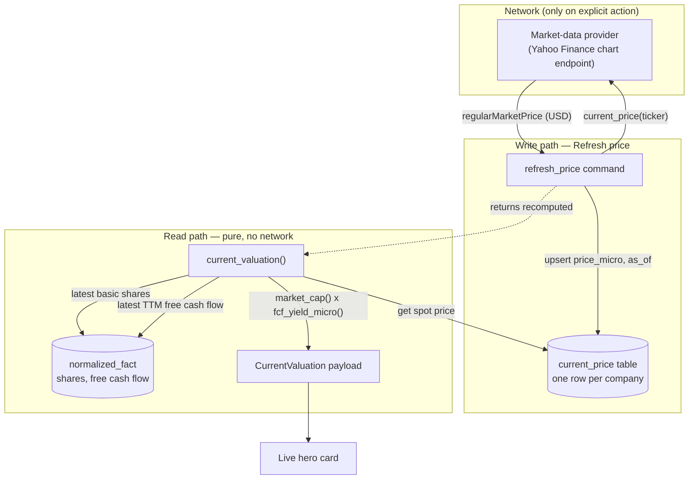
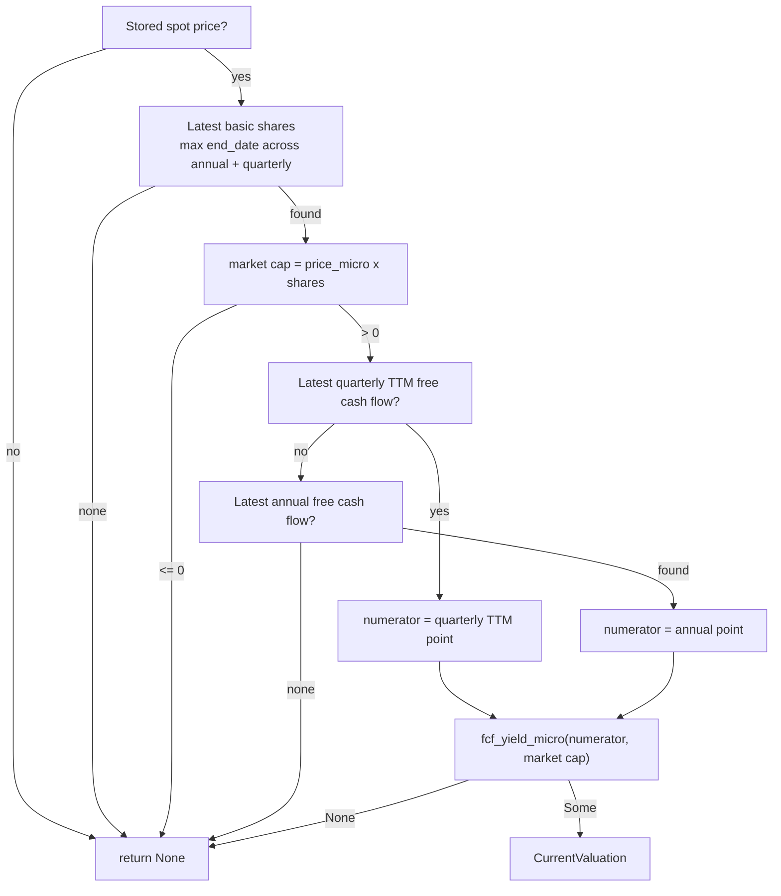
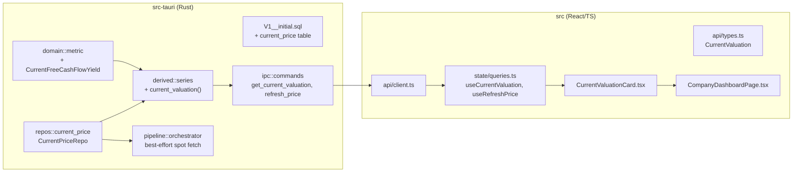

# DESIGN DOCUMENT

# CURRENT FREE CASH FLOW YIELD

**Status:** Approved for V1.0.0
**Companions:** `docs/current-fcf-yield-prd.md`, `docs/current-fcf-yield-techspec.md`
**Parent:** `docs/architecture.md`

---

## 1. Overview

This feature adds a live valuation scalar — the **current free cash flow yield** — to a system whose entire metric layer is otherwise built on **read-time derivation from immutable normalized facts**. The design challenge is that a "current" figure depends on a value (today's stock price) that is *not* an SEC fact and changes continuously, while the architecture's correctness guarantees rest on never persisting a computed product.

The resolution is a clean split:

- The **one volatile input** that cannot be derived — the current spot price — is **persisted** in a dedicated single-row-per-company table, stamped with the time it was fetched.
- **Everything else** (market cap, the yield, the numerator selection) is **derived at read time** from that stored price plus the existing normalized facts, exactly like every other metric.

This keeps the read path offline and pure, confines all network I/O to an explicit user action, and reuses the existing pure formulas without introducing any new math.

---

## 2. Data flow

The full company-refresh pipeline also calls the provider for the spot price as a **best-effort** step: a price-fetch failure records a warning event and continues, never failing ingestion.

---

## 3. Computation

### 3.1 Numerator selection

The numerator is the most recent **quarterly trailing-twelve-month** free cash flow point, falling back to the most recent **annual** free cash flow point only when no quarterly trailing point exists. Quarterly trailing-twelve-month is the freshest reasonable measure of "current" free cash flow; the annual fallback ensures companies that report only annually still produce a figure.

### 3.2 Reused primitives

No new arithmetic is introduced. The design reuses two existing pure functions from the derived-metric layer:

- `market_cap(close_micro, shares)` — an `i128` product clamped to `i64`, where `close_micro` is price × 1e6 and `shares` is a raw count.
- `fcf_yield_micro(free_cash_flow, market_cap)` — returns the decimal-ratio × 1e6, or `None` when market cap is non-positive. A negative free cash flow yields a valid negative ratio, which is preserved.

---

## 4. Key decisions & trade-offs

### 4.1 Persist the price; derive everything else

**Decision.** Store the spot price (the one input that is genuinely time-varying and not an SEC fact); derive market cap and yield at read time.

**Alternatives considered.**
- *Persist the computed market cap or the computed yield.* Rejected — it reintroduces exactly the desync risk the read-time architecture exists to eliminate: a later shares restatement would silently leave a stored product wrong.
- *Fetch the price live on every read.* Rejected — it breaks the offline-after-ingest guarantee, makes the dashboard slow and network-dependent, and couples a render to provider availability.

**Trade-off.** The displayed figure is only as fresh as the last Refresh. This is acceptable and is made honest by the freshness badge and timestamp stamps (see §5).

### 4.2 Honest freshness over implied liveness

**Decision.** The "LIVE" badge is conditional on the stored price being under 24 hours old; otherwise the badge reads "QUOTED · <age>". The price's `as_of` timestamp is always shown.

**Rationale.** Accuracy is a hard constraint, not a presentation preference. Labeling a three-day-old price as "LIVE" would be a form of inaccuracy. The card tells the truth about how current its inputs are.

### 4.3 Never fabricate

**Decision.** `current_valuation` returns `None` whenever any input is missing or market cap is non-positive; the UI renders a prompt, not a number.

**Rationale.** A plausible-but-wrong yield is worse than no yield. This mirrors the existing derived layer's `Option` discipline end to end through the IPC boundary to the UI's "No live quote yet" state.

### 4.4 A scalar, not a series

**Decision.** The current free cash flow yield is modeled as a single `CurrentValuation` payload returned by a dedicated command, **not** as a point in `get_metric_history`.

**Rationale.** It has a fundamentally different shape: one value "as of now," not a per-period series. The series dispatcher returns an empty vector for the `current_market_cap` and `current_free_cash_flow_yield` metric identifiers, with an explicit arm documenting that these are served by `current_valuation`. This keeps the chart/series code honest (it never invents a one-point "series") and gives the UI a purpose-built payload with all the freshness metadata it needs.

---

## 5. UI design — the live hero card

The card is the single attention-drawing element on the dashboard. Its visual language is deliberately divergent from the surrounding muted period-end tiles:

- **Ring + glow:** an accent-colored ring and a soft outer shadow elevate the card off the page.
- **Pulsing LIVE badge:** a small pill with a pulsing dot signals liveness when fresh; it degrades to a muted "QUOTED · <age>" pill when stale (§4.2). The pulse is gated on `motion-safe`.
- **Sign-colored hero number:** green for a positive yield, red for negative; the sign is also legible in the number text itself, so color is never the sole signal.
- **Neutral delta chip:** the move versus the last period-end yield is shown in a neutral accent color with a directional arrow glyph — contextual information, not a value judgment.
- **Spelled-out math and freshness stamps:** the full computation and every input's vintage are visible, upholding the product's auditability principle.

State handling (loading / null / error / success) is enumerated in the PRD §6.3 and implemented in the card component.

---

## 6. Component & module impact

---

## 7. Release — version 1.0.0

This feature is the V1.0.0 capstone. The version bump touches:

| Touchpoint | File |
|---|---|
| Rust crate version (drives `ping`) | `src-tauri/Cargo.toml` |
| Tauri bundle (drives DMG filename) | `src-tauri/tauri.conf.json` |
| npm package | `package.json`, `package-lock.json` |
| In-app footer string | `src/components/AppShell.tsx` |
| Mock `ping` version | `src/test-mock-tauri.ts` |
| Installer references | `DEMO_README.md`, tracked DMG artifact |

A fresh ad-hoc-signed DMG is built and the prior 0.1.0 artifact is replaced.
